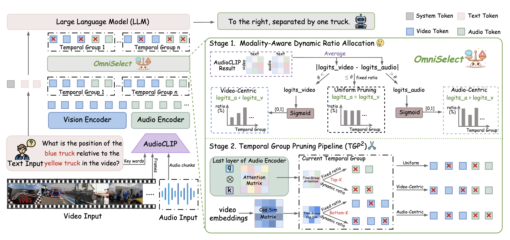

<div align="center">

#  OmniSelect: Dynamic Modality-Aware Token Compression for Efficient Omni-modal Large Language Models


<p>
🚀 Training-Free · 🎧 Audio-Visual Reasoning · ⚡ Efficient OmniLLMs
</p>

</div>

---

## 📌 Overview

OmniSelect is a **training-free modality-adaptive token compression framework** for Omni-modal Large Language Models (OmniLLMs).  
Unlike existing approaches that rely on fixed modality guidance, OmniSelect dynamically determines whether **audio**, **video**, or **both modalities** are more important for the current query.

The framework introduces:

- **Dynamic Modality-Aware Ratio Allocation**
- **Video-Centric / Audio-Centric / Uniform Pruning**
- **Temporal Group Pruning Pipeline (TGP²)**
- **Fine-grained multimodal token selection**

OmniSelect significantly reduces multimodal token redundancy while preserving reasoning performance.

---

## 🔥 Highlights

- ⚡ **1.19× ~ 1.33× inference speedup**
- 💾 **2.58GB ~ 2.77GB GPU memory reduction**
- 🎯 Retains **94% ~ 99%** of full-token accuracy
- 🧠 Dynamically adapts pruning strategy based on query semantics
- 🚫 Fully **training-free**

---

## 🏗️ Framework

<p align="center">
  
</p>

OmniSelect consists of two stages:

1. **Modality-Aware Dynamic Ratio Allocation**
   - Estimate audio/video relevance using AudioCLIP
   - Dynamically choose pruning strategy

2. **Temporal Group Pruning Pipeline (TGP²)**
   - Attention-guided audio token pruning
   - Bottom-K similarity-based visual token pruning

---

## 📊 Main Results

### WorldSense

| Method | Retained Ratio | Accuracy |
|---|---|---|
| Full Tokens | 100% | 45.62 |
| OmniZip | 30% | 41.83 |
| OmniSelect | 30% | **44.42** |

### DailyOmni

| Method | Retained Ratio | Accuracy |
|---|---|---|
| Full Tokens | 100% | 62.82 |
| OmniZip | 45% | 56.14 |
| OmniSelect | 45% | **58.06** |

### Efficiency

| Method | GPU Memory ↓ | Speedup ↑ |
|---|---|---|
| OmniSelect (3B) | -2.61GB | 1.19× |
| OmniSelect (7B) | -2.80GB | 1.33× |

---

## 🛠️ Installation

### Environment

```bash
conda create -n omniselect python=3.10
conda activate omniselect
```

### Install Dependencies

```bash
pip install -r requirements.txt
```

---

## 🚀 Inference

### WorldSense

```bash
bash /path/to/scripts/infer_worldsense.sh
```

### DailyOmni

```bash
bash /path/to/scripts/infer_dailyomni.sh
```

### OmniVideoBench

```bash
bash /path/to/scripts/infer_omnivideo.sh
```

---

## ⚙️ Input Configuration

- Video FPS: **2 FPS**
- Frame budgets:
  - 32
  - 64
  - 128
  - 512 (VideoMME)
- Resolution:
  - `128 × 28 × 28`

---

## 📂 Supported Benchmarks

- WorldSense
- DailyOmni
- OmniVideoBench
- VideoMME

---

## 🧩 Supported Models

- Qwen2.5-Omni-3B
- Qwen2.5-Omni-7B

---

## 📖 Citation

```bibtex
@article{omniselect2026,
  title={OmniSelect: Dynamic Modality-Aware Token Compression for Efficient Omni-modal Large Language Models},
  author={Anonymous Authors},
  journal={NeurIPS 2026},
  year={2026}
}
```

---

## 🙏 Acknowledgement

We thank the authors of:

- Qwen2.5-Omni
- OmniZip
- DyCoke
- AudioCLIP

for their excellent open-source contributions.

---

## ⭐ Star Us

If you find this project useful, please consider giving it a ⭐ on GitHub!
